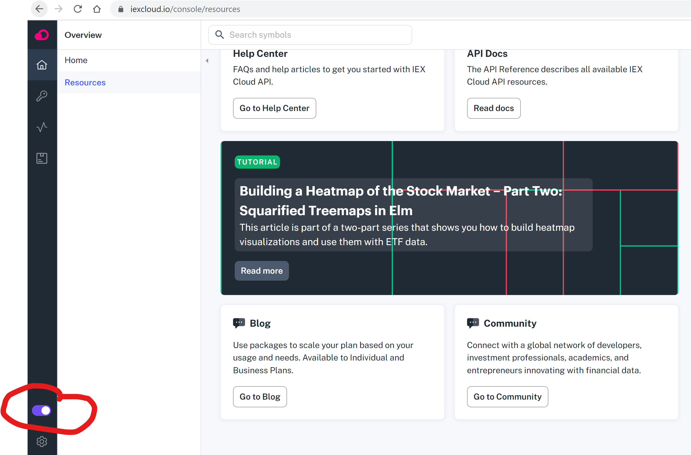

# Stock trading web app with Tom Demark indicator
### Video Demo:  https://youtu.be/p76vhs50b6c

1. ### Requirements.
    All codes been written in the CS50's VS Code. The requirement to run this app is below:
    - cs50
    - Flask
    - Flask-Session
    - requests


1. ### Web App Hosting
    This web app used sqlite database.
    sqllite will not work if want to host it using heroku, you need to switch to PostresSQL as database.
    For more details visit - [CS50 Page](https://cs50.readthedocs.io/heroku/).

    In the app.py line 26. Need to switch this line out
    ```py
    db = SQL("sqlite:///finance.db")
    ```
    With this:
    ```py
    uri = os.getenv("DATABASE_URL")
    if uri.startswith("postgres://"):
        uri = uri.replace("postgres://", "postgresql://")
    db = SQL(uri)
    ```
    Don't forget to import OS on top of the app.py file.
    ```py
    import os
    ```

1. ### Quote from Tom demark

    This is the book i've read on how Tom Demark indicator works:

    


    Here are the quotes from the book starting from P.33
    > *For a bearish TD Price Flip, there must be nine consecutive closes, each one less than the corresponding close four bars earlier.*

    > *If, at any point, the sequence—of nine consecutive closing prices less
        than the closing price four bars earlier (up to and including the close of
        TD Buy Setup bar nine)—is interrupted,the developing TD Buy Setup
        will be canceled and must begin anew.*

    So based on the above. I have implemented this indicator in the helper.py
    ```py
    #starting from quote[4].
    for i in range(4, len(quote)):
        #quote is a list of data pull from the iex APi http
        if quote[i]['close'] < quote[i - 4]['close']:
            buy_count += 1
            #any time there's a price flip, count needs to reset and count again.
            sell_count = 0
        elif quote[i]['close'] > quote[i - 4]['close']:
            sell_count +=1
            #any time there's a price flip, count needs to reset and count again.
            buy_count = 0
        if buy_count > sell_count:
            recommend = 'Buy'
            count = buy_count
        else:
            recommend = 'Sell'
            count = sell_count
    ```

1. ### iex sandbox setup.
    ### Turn on sandbox mode so it gives you the sandbox api key
   <p align="left">
   
   </p>

1. ### http request:
    basically use the below URL:
    ```
    https://sandbox.iexapis.com/stable/stock/{urllib.parse.quote_plus(symbol)}/chart/5y?token={api_key}
    ```
    Where {urllib.parse.quote_plus(symbol)} is the stock symbol e.g. FB, AMZN, NFLX, GOOG....
    I have used 5y above to pull 5 years worth of data but you can use any of the below:
    |RANGE|DESCRIPTION|SOURCE|
    |-----|-----------|------|
    |max|All available data up to 15 years|Historically adjusted market-wide data|
    |5y|Five years|Historically adjusted market-wide data|
    |2y|Two years|Historically adjusted market-wide data
    |1y|One year|Historically adjusted market-wide data
    |ytd|Year-to-date|Historically adjusted market-wide data
    |6m|Six months|Historically adjusted market-wide data
    |3m|Three months|Historically adjusted market-wide data
    |1m|One month (default)|Historically adjusted market-wide data
    |1mm|One month|Historically adjusted market-wide data in 30 minute intervals
    |5d|Five Days|Historically adjusted market-wide data by day.
    |5dm|Five Days|Historically adjusted market-wide data in 10 minute intervals
    |date|Specific date|If used with the query parameter chartByDay, then this returns historical OHLCV data for that date. Otherwise, it returns data by minute for a specified date, if available. Date format YYYYMMDD. Currently supporting trailing 30 calendar days of minute bar data.
    |dynamic|One day|Will return 1d or 1m data depending on the day or week and time of day. Intraday per minute data is only returned during market hours.

    Examples, for Twitter (ticker = twtr)
    - [/stock/twtr/chart](https://cloud.iexapis.com/stable/stock/twtr/chart)
    - [/stock/twtr/chart/max](https://cloud.iexapis.com/stable/stock/twtr/chart/max)
    - [/stock/twtr/chart/5y](https://cloud.iexapis.com/stable/stock/twtr/chart/5y)
    - [/stock/twtr/chart/2y](https://cloud.iexapis.com/stable/stock/twtr/chart/2y)
    - [/stock/twtr/chart/1y](https://cloud.iexapis.com/stable/stock/twtr/chart/1y)
    - [/stock/twtr/chart/ytd](https://cloud.iexapis.com/stable/stock/twtr/chart/ytd)
    - [/stock/twtr/chart/6m](https://cloud.iexapis.com/stable/stock/twtr/chart/6m)
    - [/stock/twtr/chart/3m](https://cloud.iexapis.com/stable/stock/twtr/chart/3m)
    - [/stock/twtr/chart/1m](https://cloud.iexapis.com/stable/stock/twtr/chart/1m)
    - [/stock/twtr/chart/1mm](https://cloud.iexapis.com/stable/stock/twtr/chart/1mm)
    - [/stock/twtr/chart/5d](https://cloud.iexapis.com/stable/stock/twtr/chart/5d)
    - [/stock/twtr/chart/5dm](https://cloud.iexapis.com/stable/stock/twtr/chart/5dm)
    - [/stock/twtr/chart/date/20190220](https://cloud.iexapis.com/stable/stock/twtr/chart/date/20190220)
    - [/stock/twtr/chart/date/20190109?chartByDay=true](https://cloud.iexapis.com/stable/stock/twtr/chart/20190109?chartByDay=true)
    - [/stock/twtr/chart/dynamic](https://cloud.iexapis.com/stable/stock/twtr/chart/dynamic)

1. ### Other Stats calculation method:
    Parameters that returned
    ```py
        "MaxMove": max(change),
        "AvgDayChg":round(sum(change)/len(change),4),
        "Last_Close": int(last_close),
        "MaxMoveDate": MaxMoveDate,
        "Recommend": recommend,
        "count": count,
    ```
    |parameters|meaning|
    |----------|-------|
    |MaxMove|find The maximum value within the list of chanage values. Which gives me the maximum up/down side of a stock that would happen in a day.|
    |MaxMoveDate| The date when the maximum up/down side occurred.
    |AvgDayChg| Average daily change in percentage Thats normal average up/down side a stock witnin a day. find out by sum of all changes divide it by number of changes.|
    |Last_Close|The latest close price, last element in the array|
    |Recommend|spits a 'Buy' or a 'Sell'. Based on Tom Demark indicator.|
    |count|Tom Demark count, as per mention above, see [Quote from Tom demark](#quote-from-tom-demark)
